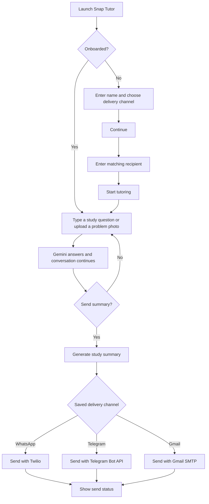

# Snap Tutor

Snap Tutor is a Streamlit study assistant. A student can type a learning question or upload a photo of a problem, receive a clear explanation, and send a conversation summary through WhatsApp, Telegram, or Gmail.

## Table of Contents

- [Overview](#overview)
- [Features](#features)
- [Tech Stack](#tech-stack)
- [Quick Start](#quick-start)
- [Requirements](#requirements)
- [Installation](#installation)
- [Configuration](#configuration)
- [Usage](#usage)
- [Architecture and User Flow](#architecture-and-user-flow)
- [Project Structure](#project-structure)
- [Delivery Channels](#delivery-channels)
- [Evaluation Checklist](#evaluation-checklist)
- [Troubleshooting](#troubleshooting)
- [Limitations](#limitations)
- [Security](#security)

## Overview

Snap Tutor is a study-focused AI chat app for understanding educational problems. Users can submit a text question, a photo, or both. The app uses a Gemini chat session for tutoring and can send a generated study summary through one selected delivery channel.

## Features

- Accepts text questions and JPG/JPEG/PNG photos of study problems.
- Uses Gemini to explain and solve educational questions.
- Keeps the tutoring conversation focused on the study topic, while allowing a new photo with a clear solution request to start a new problem.
- Collects one preferred delivery channel during onboarding and asks only for that channel's recipient.
- Generates a study summary and delivers it using the selected integration.
- Creates a topic-based Gmail subject and prefixes it with the student's name.

## Tech Stack

- Python and Streamlit for the interactive app.
- Google Gen AI SDK for Gemini tutoring and summaries.
- Twilio for WhatsApp message delivery.
- Telegram Bot API via `python-telegram-bot`.
- Gmail SMTP for email delivery.

## Quick Start

From the project root in Windows PowerShell:

```powershell
py -m venv venv
.\venv\Scripts\Activate.ps1
python -m pip install -r requirements.txt
```

Create `.streamlit/secrets.toml` from `.streamlit/secrets.toml.example`, replace its placeholders with your provider credentials, then start the app:

```powershell
streamlit run app.py
```

For macOS/Linux environment activation commands, see [Installation](#installation). Do not overwrite an existing `secrets.toml` that already contains your local credentials.

## Project Structure

```text
.
|-- app.py                         # Streamlit UI, onboarding, tutoring, and channel dispatch
|-- prompts.py                     # Tutor, welcome, summary, and email-subject prompts
|-- requirements.txt               # Python dependencies
|-- .gitignore                     # Excludes local credentials and generated files
|-- .streamlit/
|   |-- secrets.toml.example       # Credential template; contains placeholders only
|   `-- secrets.toml               # Local credentials; do not commit
|-- Through_gmail/
|   `-- sender.py                  # Gmail SMTP sender
|-- Through_telegram/
|   `-- sender.py                  # Telegram Bot API sender
`-- Through_whatsapp/
    `-- sender.py                  # Twilio WhatsApp sender
```

## Requirements

- Python 3.10 or later.
- A Gemini API key and access to the model configured in `app.py`.
- Credentials for the delivery channel(s) you intend to test.
- A recipient address/chat that is allowed to receive messages from the configured provider.

## Installation

From the project root, create and activate a virtual environment, then install dependencies.

Windows PowerShell:

```powershell
py -m venv venv
.\venv\Scripts\Activate.ps1
python -m pip install --upgrade pip
pip install -r requirements.txt
```

macOS/Linux:

```bash
python3 -m venv venv
source venv/bin/activate
python -m pip install --upgrade pip
pip install -r requirements.txt
```

## Configuration

The app reads provider credentials from Streamlit's `.streamlit/secrets.toml` file. The example file contains placeholders only.

Create `.streamlit/secrets.toml` using `.streamlit/secrets.toml.example` as a template, then replace the placeholders with credentials from your provider accounts. Do not overwrite an existing secrets file if it already contains your local settings.

Required common key:

| Key | Purpose |
| --- | --- |
| `GEMINI_API_KEY` | Authenticates Gemini requests |

WhatsApp keys:

| Key | Purpose |
| --- | --- |
| `TWILIO_ACCOUNT_SID` | Twilio account identifier |
| `TWILIO_AUTH_TOKEN` | Twilio API authentication token |
| `TWILIO_CONTENT_SID` | Twilio content template SID |
| `TWILIO_WHATSAPP_FROM` | WhatsApp-enabled Twilio sender, in `whatsapp:+E164_NUMBER` format |

Telegram key:

| Key | Purpose |
| --- | --- |
| `TELEGRAM_BOT_TOKEN` | Bot token created with Telegram's BotFather |

Gmail keys:

| Key | Purpose |
| --- | --- |
| `GMAIL_ADDRESS` | Gmail account used as the sender |
| `GMAIL_APP_PASSWORD` | Google App Password for SMTP; not the normal Gmail password |

Keep `.streamlit/secrets.toml` private. It is listed in `.gitignore`; commit only the example file with placeholder values. If a credential has been exposed, revoke and replace it with the provider before using the app.

**Important:** `app.py` currently imports all three sender modules at startup, and each sender reads its secrets when imported. As a result, all provider keys listed above must be present to start the app, even if you plan to use only one delivery channel.

## Usage

1. Enter your name and select WhatsApp, Telegram, or Gmail in onboarding.
2. Click **Continue**, then enter the recipient for that channel and click **Start tutoring**.
3. Ask a study question in text or upload a JPG/JPEG/PNG problem photo. You can also send both together.
4. Review the answer in the chat. Click **Send summary** to deliver a study note through the selected channel.
5. Use **Change delivery method** during onboarding to return to the channel choice.

## Architecture and User Flow



## Delivery Channels

### WhatsApp

Configure the Twilio account, approved content template, and WhatsApp sender in Streamlit secrets. Enter the recipient phone number in international format during onboarding. Trial accounts and WhatsApp sandboxes restrict recipients and message parameters; Twilio trial accounts may not allow the custom template variables used for a dynamic study summary. Check the current Twilio trial and WhatsApp rules before evaluating delivery.

### Telegram

Create a bot with BotFather and set `TELEGRAM_BOT_TOKEN`. The recipient must start the bot first. This app currently asks for the Telegram chat ID manually; the Telegram sender does not implement `/start` handling or automatically register chat IDs.

### Gmail

Set `GMAIL_ADDRESS` and `GMAIL_APP_PASSWORD`. Gmail SMTP generally requires 2-Step Verification and an App Password. During onboarding, enter the recipient's email address.

## Evaluation Checklist

1. Install the dependencies and configure `GEMINI_API_KEY`.
2. Confirm the app starts with `streamlit run app.py`.
3. Verify that onboarding collects the name, selected channel, and only that channel's recipient.
4. Ask a study question using text, then test a supported photo upload.
5. Confirm the tutor gives an answer with understandable reasoning and keeps unrelated questions out of scope.
6. Send a summary using a configured recipient and verify the app reports success or a useful provider error.
7. Test each provider separately; successful Gemini responses do not prove that the external delivery credentials or recipient are configured correctly.

## Troubleshooting

| Symptom | Check |
| --- | --- |
| App fails during startup with a missing secret | Confirm all keys in [Configuration](#configuration) are present; the sender modules currently load secrets at startup. |
| Gemini request fails | Check `GEMINI_API_KEY`, network access, and model availability for the configured account. |
| WhatsApp send fails | Verify the Twilio sender, recipient format, template, account status, and trial/sandbox restrictions. |
| Telegram send fails | Verify the BotFather token, recipient chat ID, and that the recipient has started the bot. |
| Gmail SMTP authentication fails | Use a Google App Password with 2-Step Verification, not the account's regular password. |

## Limitations

- The tutoring chat and onboarding data are held in Streamlit session state; the app does not provide persistent user accounts or a database.
- Telegram delivery requires the recipient to have started the bot and the chat ID to be supplied manually.
- Provider trial restrictions can prevent delivery even when the integration code and credentials are valid.
- Automated test files are not currently included in the project.

## Security

- Keep `.streamlit/secrets.toml` private and out of version control.
- Use `.streamlit/secrets.toml.example` as a template; never put active tokens or passwords in it.
- Rotate any credential that has been exposed.
